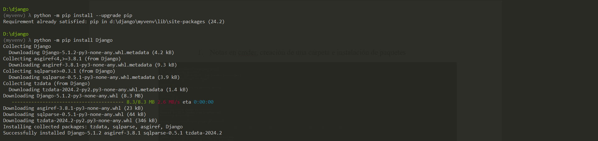
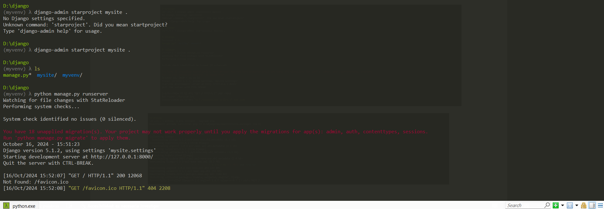
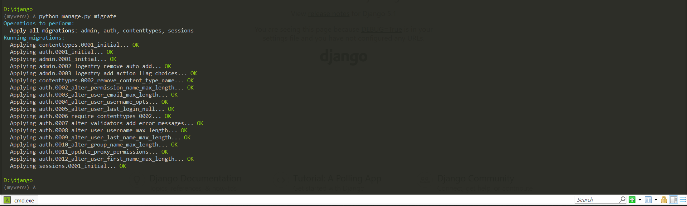
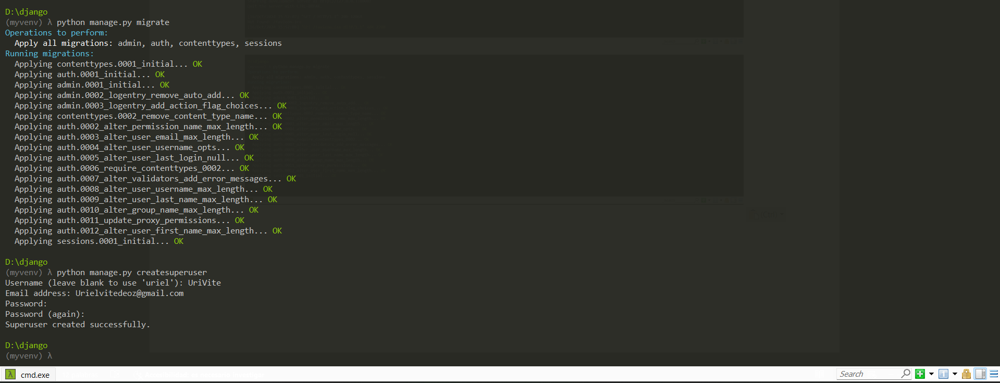
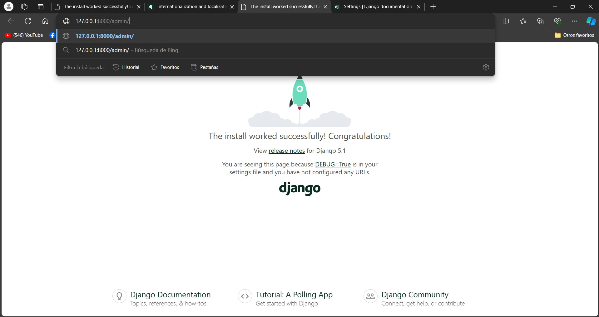
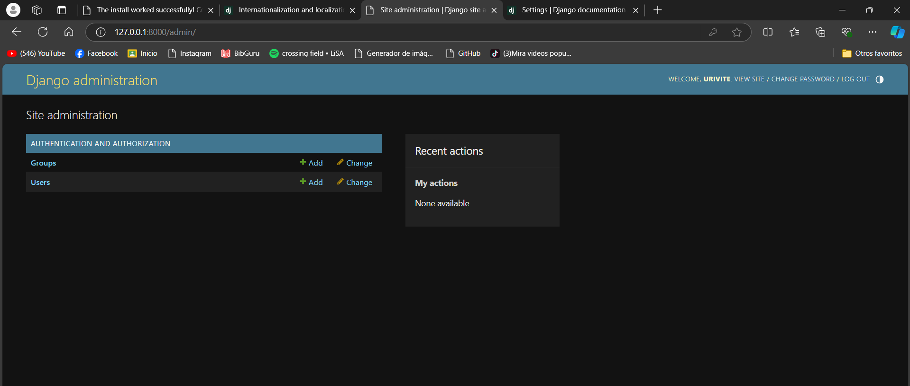
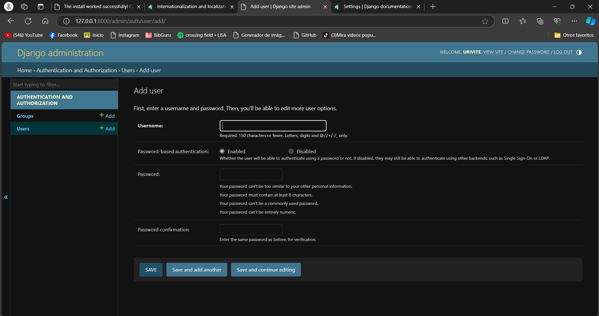
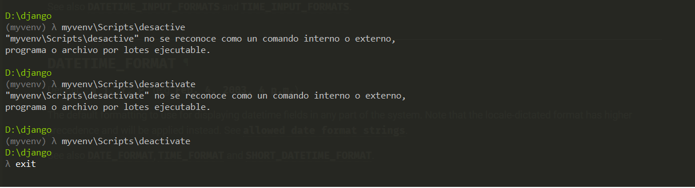

# MANUAL DE INSTALACION Y CONFIGURACION EN CMDER DE DJANGO

Creación de una carpeta e instalación de paquetes
Creamos una carpeta dentro de la unidad donde estamos el cual lavamos a llamara Django la podemos crear de manera Manual o dentro de cmder el cual una vez creada la carpeta entramos con la ruta especifica donde creamos la carpeta:
Un entorno virtual (también llamado un virtuallenv) aisla tu configuración de Python/Djando para cada proyecto esto quiere decir que cualquier cambio que hagas en un sitio web no afectara a ningún otro que estes desarrollando
•	El comando python -m venv myvenv se utiliza para crear un entorno virtual en Python. Un entorno virtual es un entorno aislado en el que puedes instalar dependencias (librerías) sin que afecten al entorno global de tu sistema.

•	El comando myvenv\Scripts\activate sirve para activar el entorno virtual que creaste con el comando venv. Activar el entorno virtual significa que, a partir de ese momento, cualquier comando que ejecutes (como instalar paquetes con pip o ejecutar scripts) se ejecutará dentro de ese entorno aislado, en lugar de en el sistema global de Python.

•	El comando myvenv\Scripts\deactivate sirve para desactivar el entorno virtual que tienes activado. Cuando desactivas el entorno virtual, tu terminal o consola vuelve a usar el entorno global de Python, es decir, el que está instalado en tu sistema y fuera del entorno aislado.

•	#Sabras que tienes virtualvenv iniciado cuando evas ue la liena de comando en tu consola tiene el prefijo (myvenv)

 
•	El comando python -m pip install --upgrade pip se utiliza para actualizar pip, que es el gestor de paquetes de Python. pip es la herramienta que te permite instalar, actualizar y gestionar paquetes o librerías en Python.
Una vez actualizada la versión del gestor de paquetes procedemos a instalara un nuevo paquete 
•	El comando python -m pip install Django se utiliza para instalar Django, que es un popular framework de desarrollo web en Python. Este framework te ayuda a crear aplicaciones web rápidamente, proporcionando herramientas y estructuras prediseñadas que facilitan la creación de sitios web, APIs, y aplicaciones complejas.
Tal y como se muestra en la imagen se está descargando la versión mas actual del paquete .

•	El comando django-admin startproject mysite . se utiliza para iniciar un nuevo proyecto de Django dentro del directorio actual (.).
Una vez puesto este comando ponemos ls para ver las carpetas que están en ese directorio 
•	El comando python manage.py runserver se utiliza para iniciar el servidor de desarrollo de Django, lo que te permite probar y ver tu aplicación web en tu navegador localmente mientras la desarrollas.

 
Una vez iniciado el servidor damos clic en la dirección que nos da el cual esta nos llevara a la página donde crearemos nuestra aplicación.
•	El comando python manage.py migrate se utiliza para aplicar migraciones a la base de datos en un proyecto Django. Las migraciones son una forma de mantener sincronizada la estructura de la base de datos (como las tablas, campos, relaciones, etc.) con los modelos que defines en tu código Python.
 
 

 
•	El comando python manage.py createsuperuser se utiliza para crear un superusuario en un proyecto Django. Un superusuario es un usuario con privilegios administrativos completos, lo que le permite acceder y gestionar todos los aspectos del panel de administración de Django.
Este comando nos pide crear un usuario Nos pide nuestro correo Gmail de igual manera nos pide crear una contraseña “Nota Imposible olvidar este comando ya que se haría todo de nuevo”
Una vez echo esto nos vamos al link donde nos arrojo el comando anteriormente donde nos llevara a esta pagianwe en el cual dentro del link se le agregara “admin/” en el cual nos llevara a otra pagina donde anotaremos el Usuario y contraseña que se nos requirió crear para poder entrar
 

Una vez dentro de la interfaz tendremos esta parte el cual como trabajo se nos asignar crear usuarios dentro de este perfil que tenemos en esta página.

  
•	El comando myvenv\Scripts\deactivate sirve para desactivar el entorno virtual que tienes activado. Cuando desactivas el entorno virtual, tu terminal o consola vuelve a usar el entorno global de Python, es decir, el que está instalado en tu sistema y fuera del entorno aislado.
Y una vez terminado el proceso de instalación procedemos a salirnos de nuestro servidor desactivándolo temporalmente.

